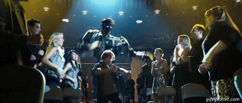
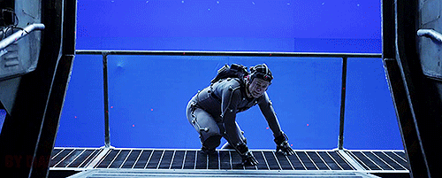
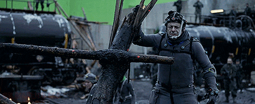
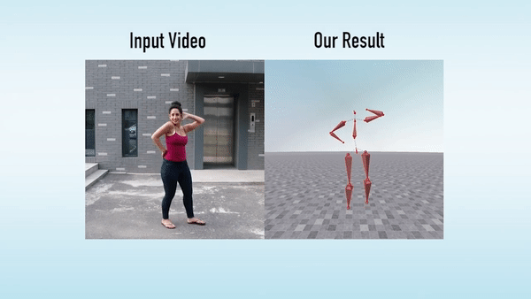
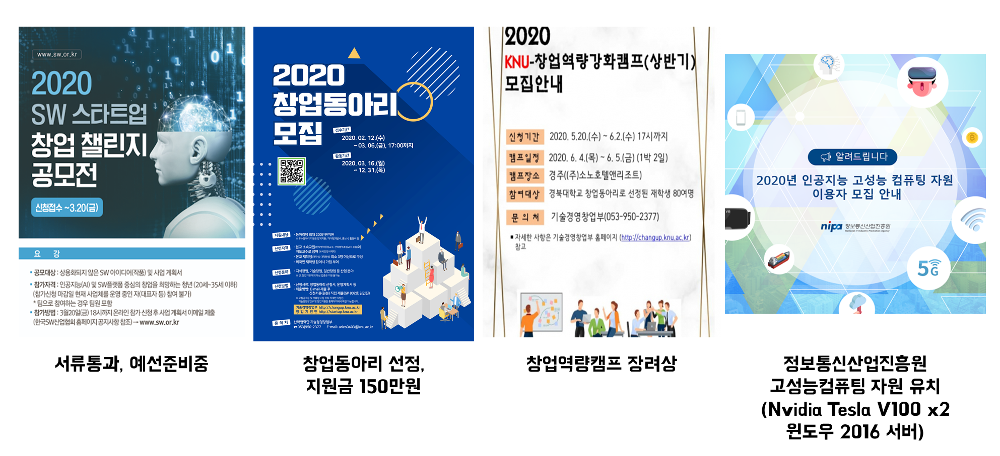
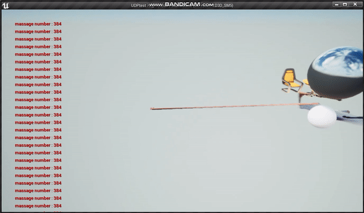

# UNREAL STEEL

상태: 중단  
종류: 팀  
포지션: 개발, 기획, 아이디어, 팀장  

[https://github.com/HP-DEVGRU/UnrealSteel](https://github.com/HP-DEVGRU/UnrealSteel)

# Introduction

기존의 하드웨어 기반 모션 캡쳐 기술을 비전 AI으로 구현한 서비스입니다. 카메라로 사용자의 모션을 인식하고 이를 3D로 복원, 실시간 motion data를 애니메이션화하여 rigging 작업을 거쳐  게임엔진에 렌더링시킵니다. 사용자는 자신의 동작대로 가상의 캐릭터를 조종할 수 있습니다.  

# Motivation

**Unreal Steel : Unreal Engine + Real steel**  

**Unreal Engine(게임엔진)**  

**Real Steel (영화)**  

영화 속 장면을 게임엔진으로 구현해보고자 시작하게 되었습니다.  

# Main Technology

## Previous Motion Capture

기존의 모션캡쳐 기술은 센서가 달린 수트와 헬멧을 쓰고 센서의 좌표 데이터를 수신하면서 이루어졌습니다. **하지만 모션캡쳐 장비와 소프트웨어들이 너무 비싸서** 높은 진입장벽이 형성되었습니다. 또한 배우가 직접 움직인 데이터만 얻을 수 있다는 단점이 있었습니다.  

  

  

  

## Ours

저희 Unreal Steel은 사용자가 카메라 하나만 있으면 그 자리에서 즉시 모션캡쳐 기술을 사용할 수 있도록 해줍니다. 심지어 모션이 담긴 유튜브 영상으로도 움직임을 캡쳐할 수 있습니다. 이는 일반 사용자에게 face app같은 컨텐츠 제공용으로 쓰일 수도 있고 컨텐츠 크리에이터에게 더 다양한 컨텐츠를 제작할 수 있도록 도와주는 툴이 될 것입니다.  

  

  

순서 : 위(좌→우)→아래(우→좌)  

# **Goals**

## From

.gif)  

## To

  

**In Real-Time!!**

# Achievement

  

# Now

현재 프로젝트는 중지되었습니다. 좌표를 retargetting하는 과정에서 지속적인 오류가 발생합니다.  

  

애니메이션화까진 구현한 모습  

  

언리얼 엔진 캐릭터와 동기화에 실패한 모습  

# Development Documents

[개발일지](https://www.notion.so/e4677b69256741b285abf4c7cf6070d0)
