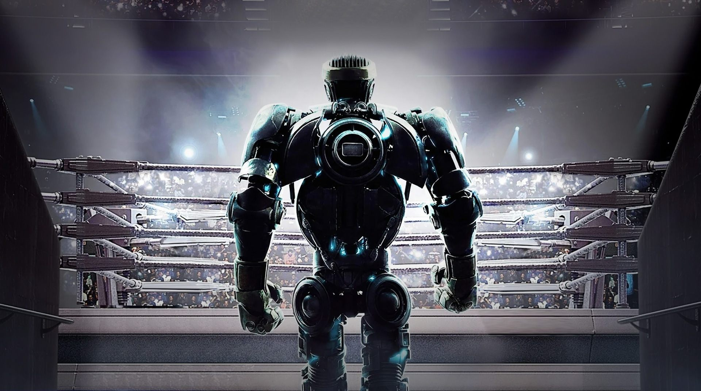
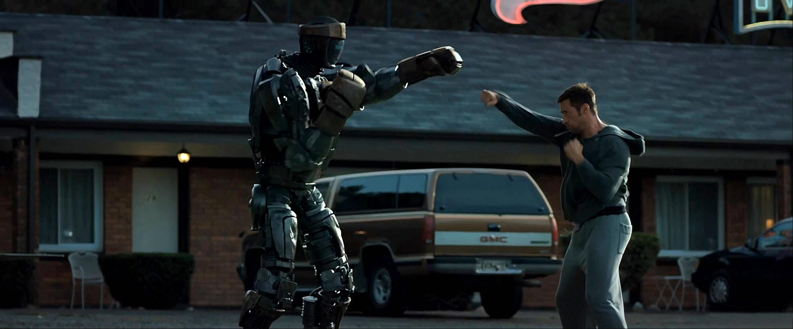
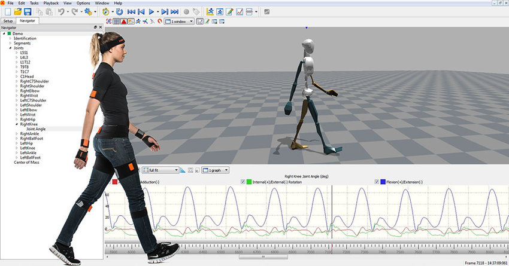
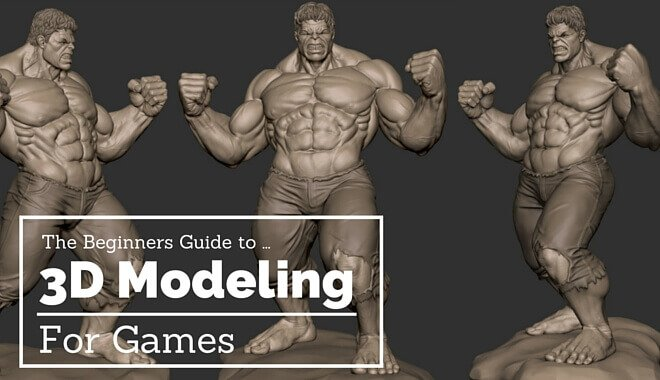
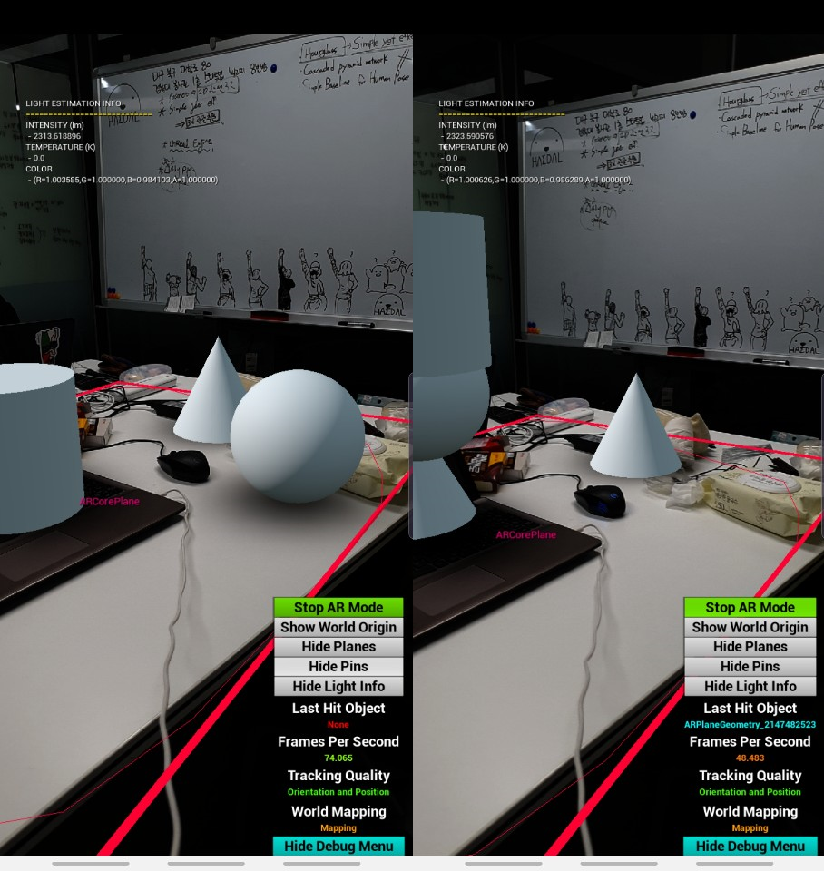
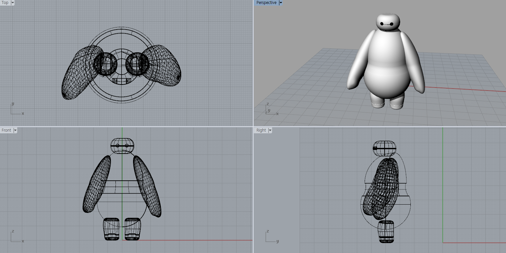
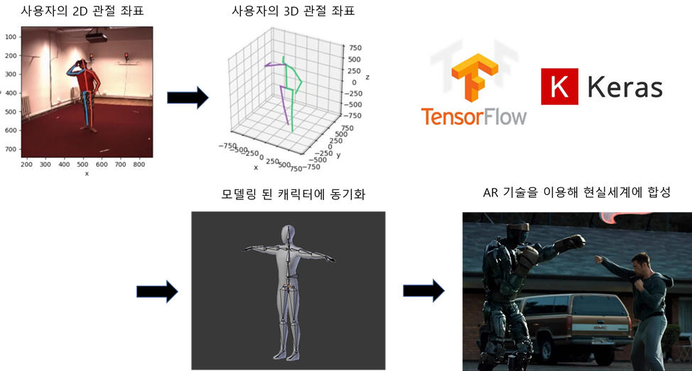
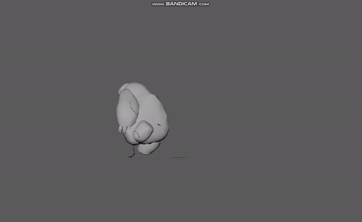
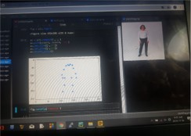

# Unreal Steel
**Just like REAL STEEL, Make 3D modeled character imitating user's motion using Unreal Engine**

# What we need

## #1 Motion Tracking

## #2 3D Modeling

## #3 Real-time render-able environment

　  

## Result

### First Hackerthon( 11/01 ~ 11/02 )

논문 리딩 및 관련 분야 지식 습득

* A simple yet effective baseline for 3d human pose estimation
* Camera Distance-aware Top-down Approach for 3D Multi-person Pose Estimation from a Single RGB Image
* Simple Baselines for Human Pose Estimation and Tracking
* 딥러닝을 이용한 2D, 3D Human Pose Estimation 가이드

개발 방향 설정

* 2D Pose estimation -> 3D transfer -> Predict 3D Pose estimation
* 3D Joint point detect -> Synchronize with modeled character on Unreal Engine
* 2D Pose estimation : Tensorflow / PoseNET
* 3D Transfer : A simple yet effective baseline for 3d human pose estimation

개발 계획

* ~~(11/05) 팀빌딩~~
* ~~(11/06) 팀 회의 및 개발 방향 재설정~~
* ~~(11/08) 2차해커톤~~

　  

### Second Hackerthon( 11/08 ~ 11/09 )

#### 게임 엔진 입문

* 언리얼 엔진 튜토리얼 영상 

  * 차근차근 알아보는 언리얼 엔진
  * 초보를 위한 언리얼 엔진 4 강좌

* 언리얼 엔진 tools 사용법

* 블루프린트의 사용

* GALAXY Note 10 - Google ARCore - Unreal Engine 연동

   

#### 캐릭터 3D 모델링

* 라이노를 이용한 캐릭터 '고고' 모델링

* 라이노 - 언리얼 엔진 간의 Format transformation ( Unreal Datasmith )

  

#### Pose Estimation 모델 Fitting by Tensorflow2.0

* 2D Joint coordinates -> 3D Joint coordinates
* Structure
  * Linear 1024
  * Batch normalization
  * RELU
  * Dropout 0.5
  * Linear 1024
  * Batch normalization
  * RELU
  * Dropout 0.5
* Total Accuracy : 0.87
* represented as **3D Camera Coordinate**, which is **zero-centered on hip joint**

#### 프레젠테이션 준비

* 첫번째장 : 인트로 / 조이름, 프로젝트 네임, 조원의 정보

* 두번째장 : 기존 방법과의 비교 사진

* 세번째장 : 기술 세부 설명 (흐름도)

* 네번째장 : 사업 확장성, 적용 가능 시장 소개 및 기대효과

* 마지막장 : 마무리 인사

  

#### 개발 방향 재설정

* Export from Google AR plug-in (ARCore) to Tensorflow model

* Adjust 3D Joint Coordinates as World coordinate from Camera coordinates

  (+ How can we transfer from Phone -> ARCore -> Tensorflow -> Unreal Engine -> ARCore -> Phone?)

  * Use Maya or Motion Builder : Maya and Motion Builder support Python scripts  
    * Phone -> Maya or MoBu (Tensorflow + Animation) -> Unreal Engine Live link -> ARCore -> Phone
  * Use just Unreal Engine : Unreal Engine also supports not only c#, but also python  
    * Phone -> ARCore -> Unreal Engine (Tensorflow + Animation + Synthesize) -> ARCore -> Phone

* Transformat Rhino Model to Unreal Engine Using Datasmith

#### 개발 계획

* ~~(11/12) 코드페어 신청서 제출~~
* ~~(11/15) 3차 해커톤~~

　  

### Third Hackerthon( 11/15~ 11/16 )

#### TODO

* Put skeletons on modeled character
* Get 2d joint coordination from source video
* Adjust Motion capture plug-in to ours methods

#### Overlay Skeleton on character

* Using 3D Max
* Export .max file and convert to .fbx file to easily import to other program

#### Searching proper tools for motion tracking animation synchronizer

* Blender -> too many errors because of too latest version
* Motion Builder -> need too many skeleton such as fingers(20 ea) and toes(20 ea)
* Maya -> Automatically create joint and easy to edit. So as Synchronize.

#### Successfully Converting 2D coordination to 3D coordination

* Sample 2D joint coordination -> 3D joint coordination
* Extract 2D joint coordination from live cam using tensorflow 2.0 lite

#### 계발계획

* ~~(11/16) 4차 개별 해커톤~~
* (11/17) PPT 최종본 제작

　  

### Fourth Hackerthon( 11/15 ~ 11/16 )

#### TODO

* Transfer 3D joint coordination data from video to MAYA (file formatting)
* Retrieving motion capture plug-in and adjust to our methods
* Try Live link function in Unreal Engine

## Reference

### 논문

[A simple yet effective baseline for 3d human pose estimation](http://openaccess.thecvf.com/content_ICCV_2017/papers/Martinez_A_Simple_yet_ICCV_2017_paper.pdf)  

[Camera Distance-aware Top-down Approach for 3D Multi-person Pose Estimation from a Single RGB Image](https://arxiv.org/pdf/1907.11346.pdf)

[Simple Baselines for Human Pose Estimation and Tracking](http://openaccess.thecvf.com/content_ECCV_2018/papers/Bin_Xiao_Simple_Baselines_for_ECCV_2018_paper.pdf)  

　  

### 참고 포스팅

[엔비디아 - real-time ray tracing and AI-based pose estimation](https://blogs.nvidia.com/blog/2019/07/30/nvidia-rtx-apollo-11-demo/?ncid=so-you-p3-97929)  

[딥러닝을 이용한 2D Human Pose Estimation 가이드](https://nanonets.com/blog/human-pose-estimation-2d-guide/)  

[딥러닝을 이용한 3D Human Pose Estimation 가이드](https://nanonets.com/blog/human-pose-estimation-3d-guide/)  

[페이스북 - Full body ar with mask R-CNN](https://research.fb.com/enabling-full-body-ar-with-mask-r-cnn2go/)  

[OpenPose + 3D Pose Baseline](http://akasuku.blog.jp/archives/73745862.html)  

[MVN Unreal live plug-in tutorial](https://www.xsens.com/hubfs/Downloads/Manuals/MVN_Unreal_live_plug-in_User_Manual.pdf)  

[MAYA 애니메이션 예제들](https://www.turbosquid.com/)  

[Unreal Engine 4.23 - MAYA 2019 Live Link Plug-in(겨우찾음)](https://github.com/ue4plugins/MayaLiveLink/releases)  

　  

### 영상

[OpenPose + 3D Pose Baseline](https://www.youtube.com/watch?v=8kT-KFkG5dE)  

[오큘러스 - hand-tracking in VR](https://www.youtube.com/watch?v=hPIs-h9uevM&feature=youtu.be)  

[페이스북 - Full body ar with mask R-CNN](https://www.facebook.com/groups/BioAI/permalink/399762017292196?sfns=mo)  

[A simple yet effective baseline for 3d human pose estimation](https://youtu.be/Hmi3Pd9x1BE)  

[쌩초보를 위한 언리얼엔진 강좌(level1)]( https://www.youtube.com/watch?v=7JtsGIjK0hM&list=PLtmQsn29mAv-PqbRIUKiRrDYSuXtOHb6S )  

[차근차근 알아보는 언리얼 엔진 - 언리얼 엔진 공식 튜토리얼]( https://www.youtube.com/watch?v=sYqbaAhdTzk&list=PLkHDai4yit5Xm9912XjC6c4TCuI3IX-Mh )  

[How to Use Maya's Quick Rig tool](https://www.youtube.com/watch?v=J4SNTE9ld0o)  

　  

### 깃허브

[**Openpose : 2D & 3D pose, face, hand and foot estimation**](https://github.com/CMU-Perceptual-Computing-Lab/openpose#output)  

[마이크로소프트 - multiview-human-pose-estimation-pytorch](https://github.com/microsoft/multiview-human-pose-estimation-pytorch)  

[3D Pose Baseline](https://github.com/una-dinosauria/3d-pose-baseline)  

[3D Pose Estimation](https://github.com/llSourcell/3D_Pose_Estimation)  

[Lifting-from-the-Deep-release](https://github.com/DenisTome/Lifting-from-the-Deep-release)  

[3D Pose Estimation - output fixed](https://github.com/ArashHosseini/3d-pose-baseline)

[언리얼 엔진 AR 개발 전 환경 세팅 방법](https://github.com/CasselKim/Programs/blob/master/In_Working/UnrealEngine/README.md)

　  

### 데이터셋

[MPII Human Pose Dataset - 관절 주석이 달린 25,000개 이미지 데이터셋](http://human-pose.mpi-inf.mpg.de/)  

[PoseTrack Dataset - MPII + 비디오 데이터셋](https://eehoeskrap.tistory.com/341)     
    
[State-of-art table for Pose Estimation on MPII Human Pose](https://paperswithcode.com/sota/pose-estimation-on-mpii-human-pose)

추가해주세요 ㅇㅅㅇ

